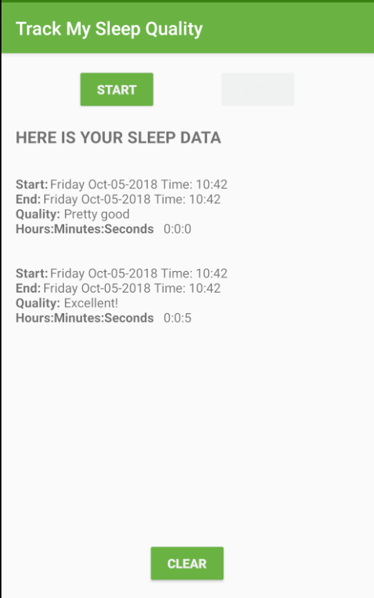

# SleepQualityTracker app

Application permettant de réaliser un suivi du temps et de la qualité du sommeil. Il s'agit de la mise en pratique de la lesson 6 [App Architecture (persistence)](https://classroom.udacity.com/courses/ud9012) de Google (Udacity)

## Concepts mis en oeuvre
 * Room database
 * DAO
 * Coroutines
 * Transformation map
 * Databinding
 * ViewModel factory
 * Utilisation des backing properties pour la protection des MutableLiveData
 * Observation des LiveData pour déclencher la navigation

## Prérequis

* Android Studio

## Installation

Télécharger le .zip du projet, extraire le contenu dans le répertoire de votre choix et ouvrir ce répertoire dans Android Studio.

## Version SDK

* minSdkVersion 19
* targetSdkVersion 28

## Dépendances

```
ext {
        version_core = "1.0.1"
        version_coroutine = "1.1.0"
        version_constraint_layout = "1.1.3"
        version_gradle = '3.3.0'
        version_kotlin = "1.3.21"
        version_lifecycle_extensions = "2.0.0"
        version_navigation = '1.0.0-beta02'
        version_room = "2.0.0"
    }
```

* Support libraries
    * androidx.constraintlayout:constraintlayout:$version_constraint_layout

* Android KTX
    * androidx.core:core-ktx:$version_core

* Room and Lifecycle dependencies
    * androidx.room:room-runtime:$version_room
    * androidx.room:room-compiler:$version_room
    * androidx.lifecycle:lifecycle-extensions:$version_lifecycle_extensions

* Coroutines
    * org.jetbrains.kotlinx:kotlinx-coroutines-core:$version_coroutine
    * org.jetbrains.kotlinx:kotlinx-coroutines-android:$version_coroutine

* Navigation
    * android.arch.navigation:navigation-fragment-ktx:$version_navigation
    * android.arch.navigation:navigation-ui-ktx:$version_navigation

* Timber
    * com.jakewharton.timber:timber:4.7.1

## Screenshots




